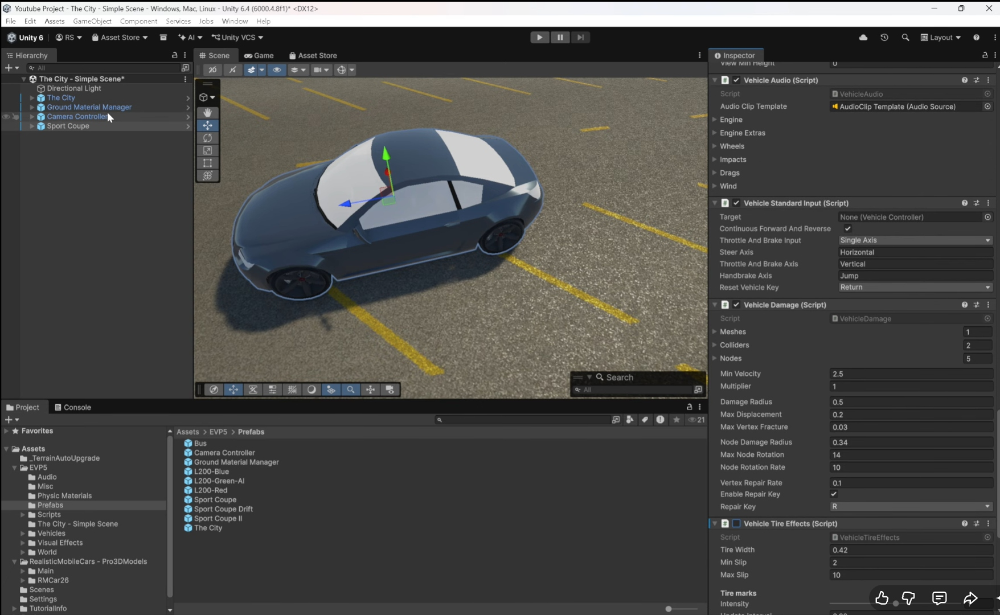
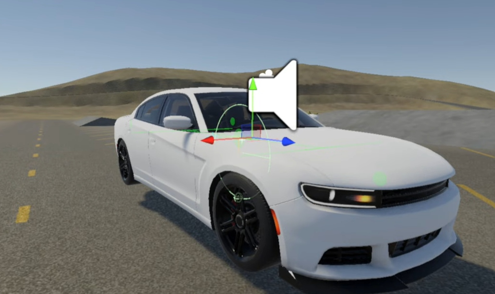
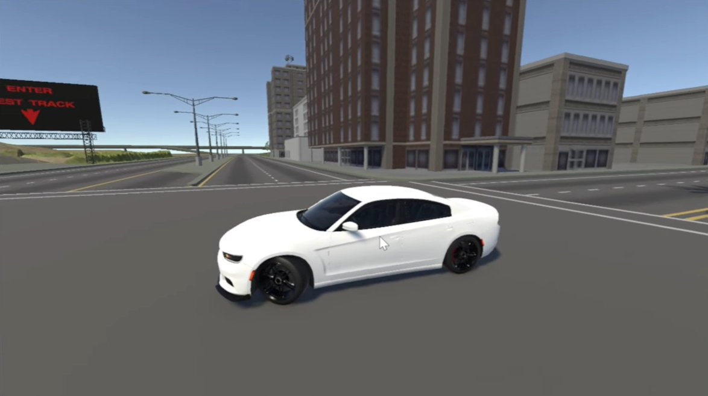
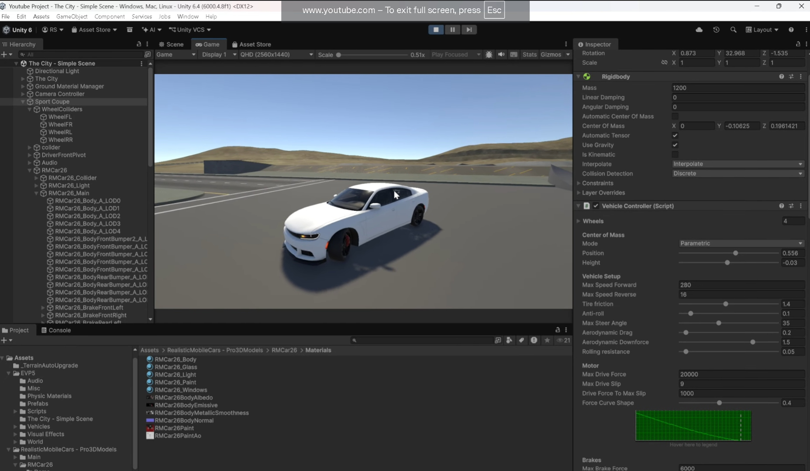

# 🚗 Car Controller UNITY

<div align="center">


A complete mobile-ready vehicle controller system built with **Edy's Vehicle Physics** for Unity.

⭐ If this project helps you, please Star this repository!

</div>

---

# 🌟 About

This project provides a simple and efficient mobile control system for **Edy's Vehicle Physics**.

Designed for Android and mobile racing games, it includes touch controls, steering buttons, acceleration, braking, and reverse controls.

Perfect for:
- Mobile Racing Games
- Open World Driving Games
- Car Simulators
- Learning Unity Vehicle Physics

---

# 📸 Screenshots









---

# 🎥 Tutorial Video

Watch the complete tutorial here:

👉 https://youtu.be/2U4LS8HSFnE?si=zSuRgHhogqBP85Oe

---

# ✨ Features

✅ Accelerator Button

✅ Brake Button

✅ Reverse Gear

✅ Android Support

✅ Unity Ready

✅ Easy Integration

✅ Lightweight System

✅ Beginner Friendly

✅ Smooth Vehicle Control

---

# 🎮 Controls

| Control | Function |
|----------|----------|
| Steering Left | Turn Left |
| Steering Right | Turn Right |
| Accelerator | Move Forward |
| Brake | Stop Vehicle |
| Reverse | Move Backward |

---

# 📦 Installation

### 1. Clone Repository

```bash
git clone https://github.com/Stephen162008/Unity-Car-Controller.git
```

### 2. Open Unity Hub

Open the project using Unity Hub.

### 3. Open Scene

Navigate to:

```text
Assets/Scenes
```

Open the main scene.

### 4. Press Play

Enjoy driving! 🚗💨

---

# 🛠 Requirements

- Unity 2022+
- Edy's Vehicle Physics
- Android Build Support

---

# 📱 Tested Platforms

| Platform | Status |
|-----------|----------|
| Android | ✅ |
| Windows | ✅ |

---

# 🚀 Future Updates

- [ ] Day & Night Cycle
- [ ] Multiple Vehicles
- [ ] Custom Car Controller

---

# 🤝 Contributing

Contributions are welcome.

Feel free to submit pull requests and improvements.

---

# ⭐ Support

If this project helped you:

⭐ Star the repository

🍴 Fork the repository

📺 Subscribe to the YouTube channel

💬 Share with other Unity developers

---

# 👨‍💻 Developer

**Reuben Stephen**

GitHub:
https://github.com/Stephen162008

YouTube:
https://youtu.be/2U4LS8HSFnE?si=zSuRgHhogqBP85Oe

---

<div align="center">

# 🚗 Thank You For Visiting

### ⭐ Don't Forget To Star The Repository ⭐

Made with ❤️ using Unity & Edy's Vehicle Physics

</div>
